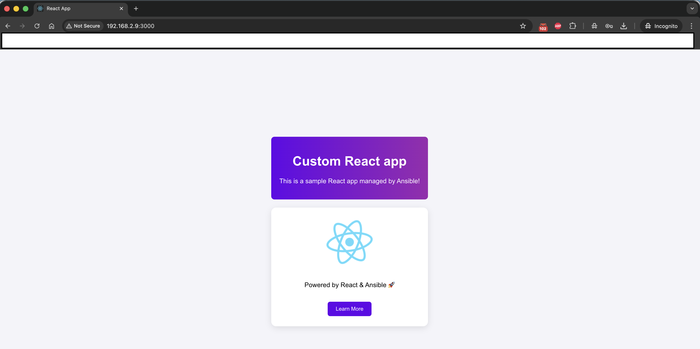

# ansible-mern-stack

Ansible playbooks and roles to provision a complete **MERN stack lab environment** (MongoDB, Express, React, Node.js).  
This repository is structured for clarity, separating configuration, inventory, and modular roles.

---

## ✨ Features

- Turns fresh Ubuntu hosts into a working MERN lab (MongoDB backend + React frontend) in one run.
- Modular roles (`common`, `dbserver`, `webserver`) so you can reuse pieces or target individual tiers.
- Opinionated defaults stored under `group_vars/`, with optional overrides per inventory group or host.
- Ships an optional React landing page and PM2 process management for the dev server.
- Idempotent tasks and use of `creates`/`when` guards minimise repeated work on subsequent runs.

---

## ✅ Prerequisites

- Control node with **Ansible 2.14+** and Python 3.9+.
- Target nodes tested on **Ubuntu 22.04 (jammy)** and reachable over SSH.
- SSH key-based access for the Ansible user declared in `inventory/hosts`.
- Required collections (install once on the control machine):
  ```bash
  ansible-galaxy collection install community.general community.crypto ansible.posix
  ```
- Optional: `pm2` viewing requires Node.js/npm on the control node if you plan to inspect the app locally.

---

## 🚦 Getting Started

1. Clone or copy the repository to your Ansible control node.
2. Update `inventory/hosts` with the IPs or DNS names of your web and database servers.
3. Adjust `group_vars/all.yaml` for global settings (users, packages, SSH keys). Tweak `webservers.yaml` / `dbservers.yaml` as needed.
4. Optionally replace `images/web-result.png` with a screenshot from your environment.
5. Run a dry run to validate connectivity:
   ```bash
   ansible -i inventory/hosts all -m ping
   ```
6. Execute the playbook (examples below) once hosts respond.

---

## 📂 Project Structure

```
ansible-mern-stack/
├── ansible.cfg                  # Ansible configuration file
├── group_vars/                  # Variables applied to groups of hosts
│   ├── all.yaml                 # Global variables
│   ├── dbservers.yaml           # Variables specific to dbservers
│   ├── webservers.yaml          # Variables specific to webservers
│   └── README_group_vars.md     # Notes on group variables usage
├── images/
│   └── web-result.png           # Screenshot of React app result
├── inventory/
│   └── hosts                    # Ansible inventory file
├── main-playbook.yml            # Main playbook entry point
├── README.md                    # Project documentation (this file)
└── roles/
    ├── common/                  # Common role (packages, users, ssh keys)
    ├── dbserver/                # MongoDB role
    └── webserver/               # Node.js / React role
```

---

## 🚀 Roles

### `common`
- Updates system packages.
- Installs base packages.
- Creates users and groups.
- Deploys SSH keys.

### `dbserver`
- Installs MongoDB from the official repository.
- Configures `mongod.conf` (bind IP, port, security).
- Ensures service is running and enabled.
- Prepares users and databases if required.

### `webserver`
- Installs Node.js and npm.
- Installs global npm packages (`express`, `create-react-app`, `pm2`).
- Initializes a React project in `{{ app_dir }}/{{ app_name }}`.
- Configures React dev server to bind `0.0.0.0`.
- Optionally deploys custom `App.js` and `App.css`.
- Manages the React app process with PM2.

---

## 🖥️ Inventory Example

`inventory/hosts`
```ini
[webservers]
webserver01 ansible_host=192.168.2.9

[dbservers]
dbserver01 ansible_host=192.168.2.8

[all:vars]
ansible_connection=ssh
ansible_user=ansibleadmin
ansible_private_key_file=~/.ssh/id_ed25519
```

---

## ⚙️ Variables

Key variables you will customise most frequently:

| Location | Variable | Purpose | Default / example |
| --- | --- | --- | --- |
| `group_vars/all.yaml` | `users` | Local users + keys provisioned by the `common` role | `[{'name': 'mern', 'group': 'mern', 'key': '/tmp/mern_id_rsa'}]` |
| `roles/common/defaults/main.yml` | `common_packages` | Base packages installed on every host | `['ntp','git','vim','unzip','curl']` |
| `group_vars/webservers.yaml` | `npm_packages` | Global npm CLIs installed before bootstrapping the app | `['express','create-react-app','pm2']` |
| `group_vars/webservers.yaml` | `app_dir` | Base directory for the React project | `/var/www/mern-app` |
| `group_vars/webservers.yaml` | `app_name` | Folder/app name created via CRA | `my_app` |
| `roles/webserver/defaults/main.yml` | `deploy_custom_page` | Toggle templated React UI | `false` (overridden to `true` in group vars) |
| `roles/dbserver/defaults/main.yml` | `mongodb_version` | MongoDB major version to install | `8.0` |
| `roles/dbserver/defaults/main.yml` | `mongodb_bind_ip` | Bind address for the database | `0.0.0.0` |
| `roles/dbserver/defaults/main.yml` | `mongodb_app_user` | Application DB username | `mern_user` |

Reference snippets for quick editing:

`group_vars/webservers.yaml`
```yaml
app_dir: "/var/www/mern-app"
app_name: "my_app"
deploy_custom_page: true
react_app:
  title: "Custom React app"
  message: "This is a sample React app managed by Ansible!"
```

`group_vars/dbservers.yaml`
```yaml
mongodb_version: "8.0"
mongodb_port: 27017
mongodb_bind_ip: "0.0.0.0"
mongodb_config_path: "/etc/mongod.conf"

mongodb_admin_user: "admin"
mongodb_admin_password: "ChangeMeStrong"
mongodb_app_db: "mern_app"
mongodb_app_user: "mern_user"
mongodb_app_password: "ChangeMeToo"
```

---

## 🔧 Customisation Tips

- **React UI**: Set `deploy_custom_page: false` to keep the default CRA homepage. When true, files under `roles/webserver/templates` and `roles/webserver/files` are deployed.
- **Node packages**: Extend `npm_packages` in `group_vars/webservers.yaml` to globally install additional CLIs before bootstrapping the app.
- **MongoDB auth**: Replace the sample credentials before running in any non-lab environment.
- **User management**: Update the `users` list to control who can log in via SSH and which key files are seeded.
- **Tags**: Use `--tags common`, `--tags webserver`, or `--tags dbserver` to run individual tiers.

---

## ▶️ Running the Playbook

Run against all hosts:
```bash
ansible-playbook -i inventory/hosts main-playbook.yml
```

Run only webserver role:
```bash
ansible-playbook -i inventory/hosts main-playbook.yml --tags webserver
```

Run only dbserver role:
```bash
ansible-playbook -i inventory/hosts main-playbook.yml --tags dbserver
```

Run in check mode first when changing variables:
```bash
ansible-playbook -i inventory/hosts main-playbook.yml --check
```

---

## 🌐 Access

- **Web App (React):**  
  Open `http://<webserver_ip>:3000/`

- **Database (MongoDB):**  
  Connect via `mongosh`:  
  ```bash
  mongosh "mongodb://mern_user:ChangeMeToo@<dbserver_ip>:27017/mern_app?authSource=mern_app"
  ```

---

## 📸 Result

<p align="center">
  
</p>

---

## 📝 Notes

- Roles are idempotent; re-running should not produce unnecessary changes.
- `deploy_custom_page: true` triggers templating of React components.
- MongoDB repository setup requires a correct codename (e.g., `jammy` for Ubuntu 22.04).
- When testing locally with Vagrant or cloud instances, ensure port **3000/tcp** (React) and **27017/tcp** (MongoDB) are open in firewalls/security groups.

---

## 🛠️ Troubleshooting

- **`Cannot find module 'pm2'`**: ensure `npm_packages` includes `pm2` or install manually on the web server.
- **MongoDB repo 404**: verify `mongodb_version` matches an available release for your Ubuntu codename.
- **React app not reachable**: confirm the PM2 process is running (`pm2 status`) and that the `.env` file contains `HOST=0.0.0.0`.
- **SSH key errors**: the `common` role expects local public keys at paths defined in `users[].key`; adjust the list or provide the files before running.

---
